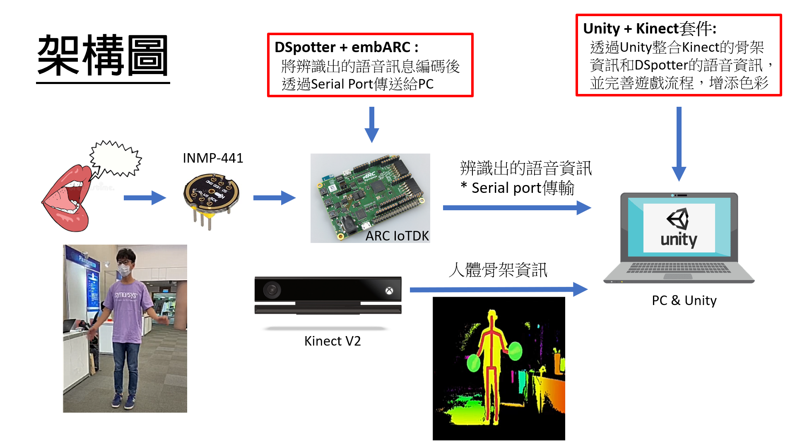
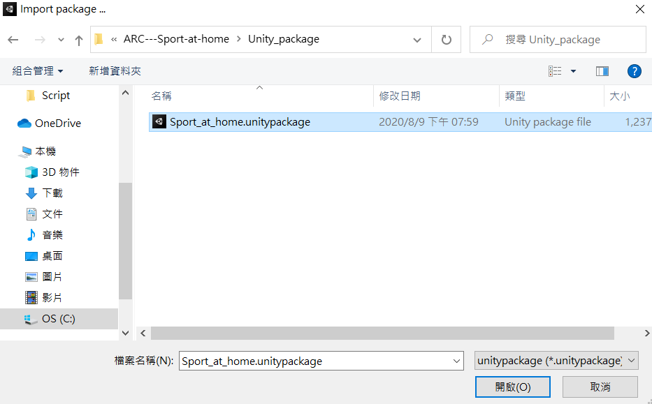
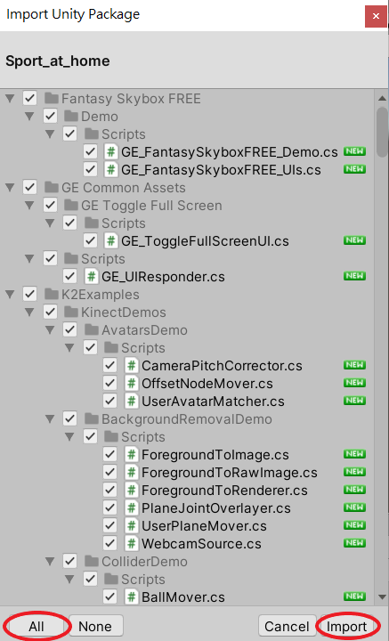
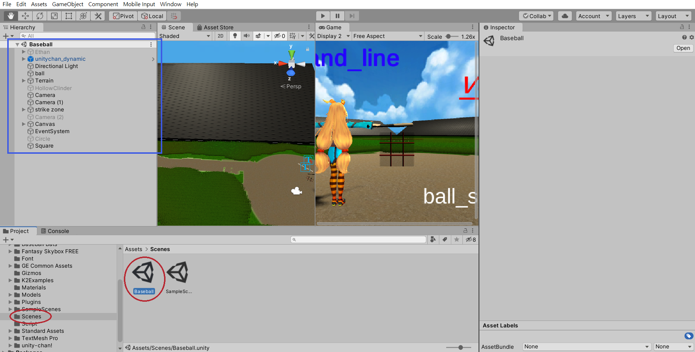

# ARC---Sport-at-home

* [Introduction](#introduction)
* [System Architecture](#system-architecture)
* [Hardware and Software Setup](#hardware-and-software-setup)
	* [Hardware Setup](#hardware-setup)
	* [Software Setup](#software-setup)
* [User Manual](#user-manual)
	* [SoftWare Environment](#software-environment)
	* [HardWare Environment](#hardware-environment)
	* [Download Source Code](#download-source-code)
	* [Run Code](#run-code)
		* [embARC](#embarc)
		* [Unity](#unity)
* [Problem](#problem)

## Introduction
This project tited **Sport , at home** is designed to allow batters to practice indoors during the Coronavirus Outbreak which combines ARC IOTDK to implement voice recognition to operate the game interface , KINECT V2 to detect batters' motions and UNITY to create a simple 3D baseball game.

## System Architecture
  
## Hardware and Software Setup
### Hardware Setup
The Hardware requirements are as below:
- DesignWare ARC IoT Development Kit
- inmp-441(voice sensor)
- KINECT V2(xbox one)
- PC
- Micro USB To USB **x1**

### Software Setup
The Software requirements are as below:
- embARC Open Source Platform
- MetaWare Development Toolkit & GNU Toolchain
- DSpotter(Cyberon)
- Unity + Kinect plugin
- Kinect for Windows SDK 2.0

## User Manual
### SoftWare Environment
1.	Installing [Unity](https://store.unity.com/?_ga=2.247763335.1014993985.1596985340-1590034984.1596985340#plans-individual)  
2.	Installing [Environmental Settings for ARC IoTDK](https://docs.google.com/presentation/d/1IZgiAmwunmWSda6N9_mpmO7g144-W_fN/edit#slide=id.p1)  
3.	Installing [Kinect for Windows SDK 2.0](https://www.microsoft.com/en-us/download/details.aspx?id=44561)
### HardWare Environment
1.	Connecting ARC & INMP441

2.	Connecting ARC **(Dataport)** & PC by `Micro USB To USB`
3.	Connecting Kinect V2 & PC, then you can test it by `Kinect for Windows SDK 2.0` for confirming it works fine    

### Download Source Code
1.	Installing `Unity_package` from github
2.	Installing `embARC` from github
### Run Code
#### embARC
1.	Use `Visual Code` to open embARC folder
2.	Let `terminal` go to DSpotter_sample
3.	Key in `gmake TOOLCHAIN=mw BOARD=iotdk DIG_NAME=IoTDK gui`
4.	Click `ok` and wait a second
5.	Click `run`
#### Unity
1.	Open `Unity Hub` to create a new 3D repository  

2.	Click Assets -> Import Package -> Custom Package  

3.	Open Sport_at_home.unitypackage  

4.	Import All  

5.	Double Click Scenes -> Baseball, then you can find the blue square appear  

6.	Choose Game -> Display2  

7.	Click Run ! (You can click `Maximize` to maximize the game window, or Click `Maximize On Play` before Click Run)  

## Problem
IF you have problem like below image, please check which `COM?` is your ARC connecting with PC, then Double Click Script -> adforce to revise `COM3` to your `COM?`  

